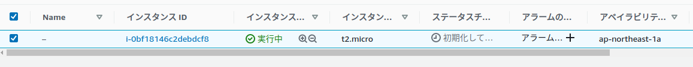

# TUTORIAL.md

## AWS CLIのセットアップ

AWS CLIをインストールする

```terminal
curl "https://awscli.amazonaws.com/awscli-exe-linux-x86_64.zip" -o "awscliv2.zip"
unzip awscliv2.zip
sudo ./aws/install
```

[このURL](https://console.aws.amazon.com/iam/home#/security_credentials)からアクセスキーを作成  

認証情報を設定  

```terminal
aws configure
```

先程作成したキーからIDとSecret Keyを設定  
Default region nameは`ap-northeast-1`  
Default output formatは`json`  

## EC2インスタンスを作成

aws.tfを作ってみる

```tf
terraform {
  required_providers {
    aws = {
      source  = "hashicorp/aws"
      version = "~> 2.70"
    }
  }
}

provider "aws" {
  profile = "default"
  region  = "ap-northeast-1"
}

data aws_ssm_parameter amzn2_ami {
  name = "/aws/service/ami-amazon-linux-latest/amzn2-ami-hvm-x86_64-gp2"
}

resource "aws_instance" "example" {
  ami           = data.aws_ssm_parameter.amzn2_ami.value
  instance_type = "t2.micro"
}
```

プロジェクトを初期化

```terminal
terraform init
```

ディレクトリ構成をチェック

```terminal
terraform fmt
```

tfファイルの構成が有効かチェック

```terminal
terraform validate
```

どこが変更されるか確認

```terminal
terraform plan
```

インフラを構築

```terminal
terraform apply
```

`Enter a value:`と出たらyesを入力する  

色々出たあとに

```terminal
Apply complete! Resources: 1 added, 0 changed, 0 destroyed
```

と表示されたら成功。  

## できたか確認

実際にどんな構成で作成されたか次のコマンドでわかる。

```terminal
terraform show
```

コンソールでも確認しよう


ちゃんと作れている  

## インフラの削除

作ったインフラを削除したいとき、わざわざコンソールからひとつひとつ消す必要はない。  

次のコマンドを実行しよう

```terminal
terraform destroy
```

## References

[Get Started - AWS](https://learn.hashicorp.com/collections/terraform/aws-get-started)
[Installing, updating, and uninstalling the AWS CLI version 2 on Linux](https://docs.aws.amazon.com/cli/latest/userguide/install-cliv2-linux.html)
[Terraformで最新のAmazon Linux 2のAMI IDを取得してEC2を構築する](https://dev.classmethod.jp/articles/launch-ec2-from-latest-amazon-linux2-ami-by-terraform/)
